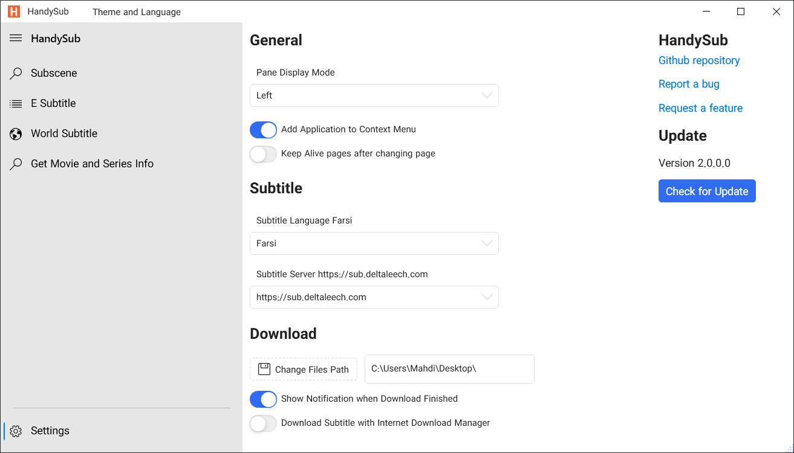
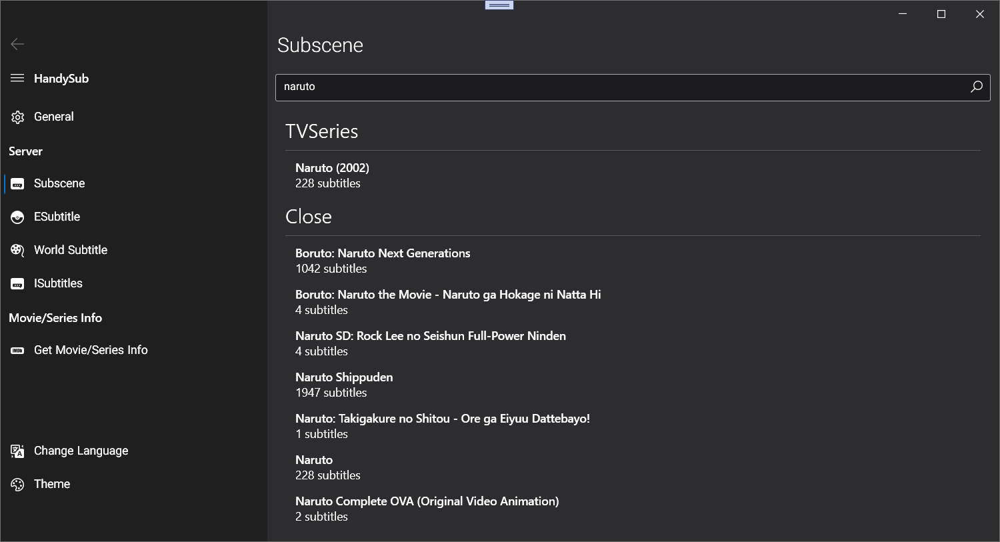
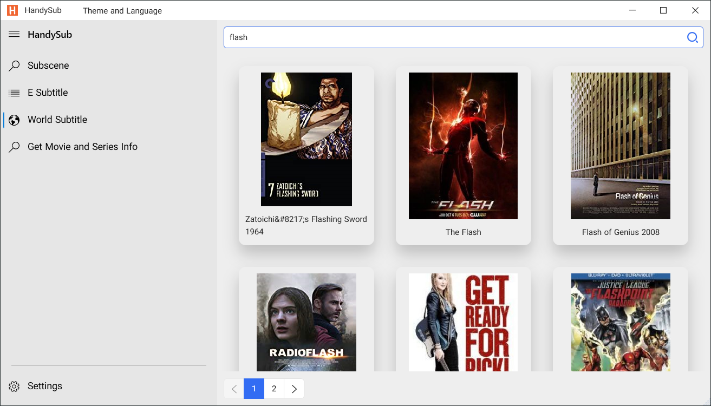
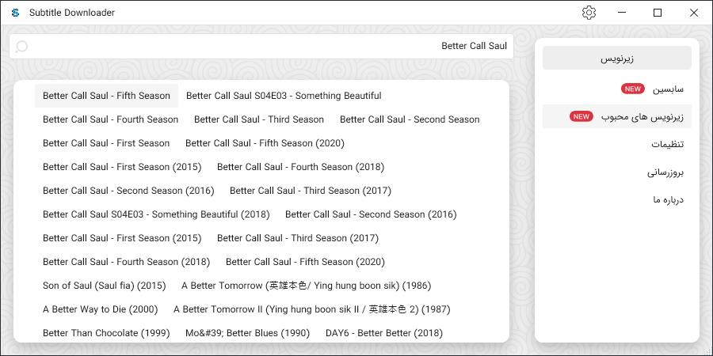
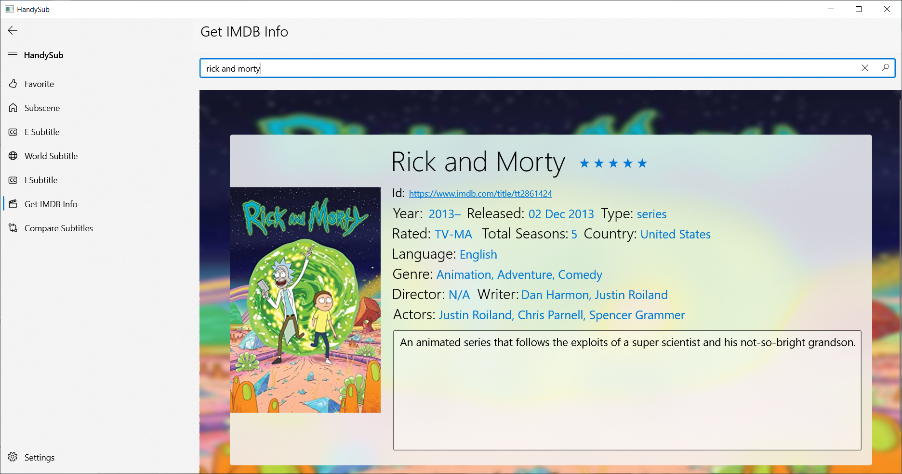
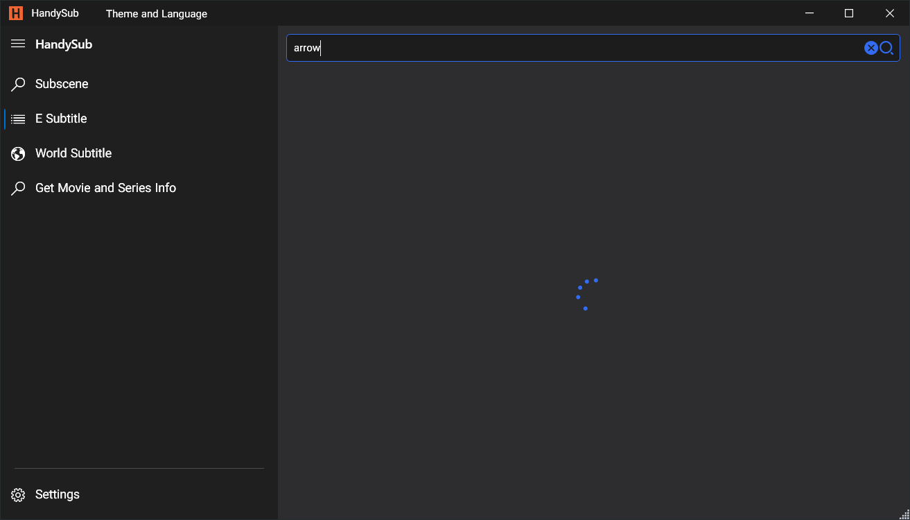
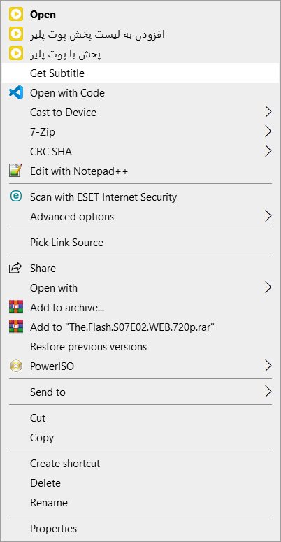

# HandySub
 Download Subtitle from Subscene

A quick and easy Application to download movie and series subtitles from the Subscene and other subtitle websites.

	<b>🙌 Donate Bitcoin with <a href="https://link.trustwallet.com/send?coin=0&address=bc1qzs4kt4aeqym6gsde669g5rksv4swjhzjqqp23a">Trust</a>🙌</b> 
	<b>🙌 Donate ETH with <a href="https://link.trustwallet.com/send?coin=60&address=0x40Db4476c1D498b167f76A2c7ED9D45b65eb5d0C">Trust</a>🙌</b>  
	<b>🙌 Bitcoin: bc1qzs4kt4aeqym6gsde669g5rksv4swjhzjqqp23a <b>
	<b>🙌 ETH: 0x40Db4476c1D498b167f76A2c7ED9D45b65eb5d0C<b>

- Get Movie\Series Information from IMDB
- Download Subtitle from Subscene
- Supports all subtitle languages
- Ability to run through the Windows right click menu
- Very fast and flexible
- Ability to personalize interface and Settings
- Dark and Light Theme
- Multiple servers
- Ability to Search between subtitles
- Multi Language Interface

